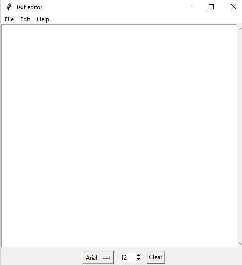

## Features I implemented:
* 🔹 Full file handling (Open, Save, Save As) using filedialog.
* 🔹 Dynamic UI updates with success/error labels.
* 🔹 Customizable typography (Font family and size manipulation).
* 🔹 System clipboard integration (Cut, Copy, Paste) via event generation.

---
## Output

